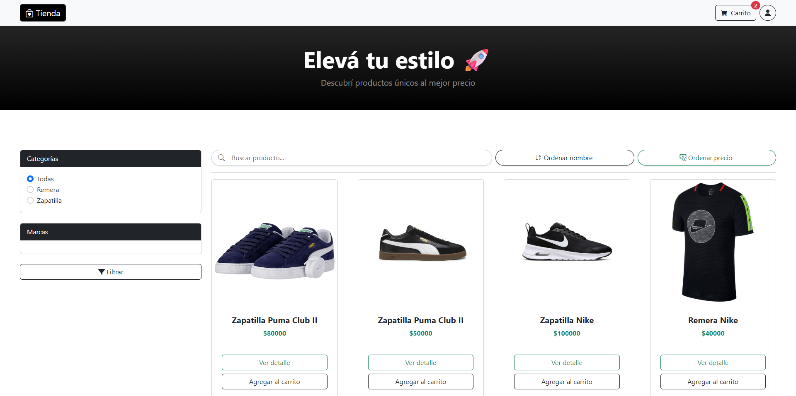
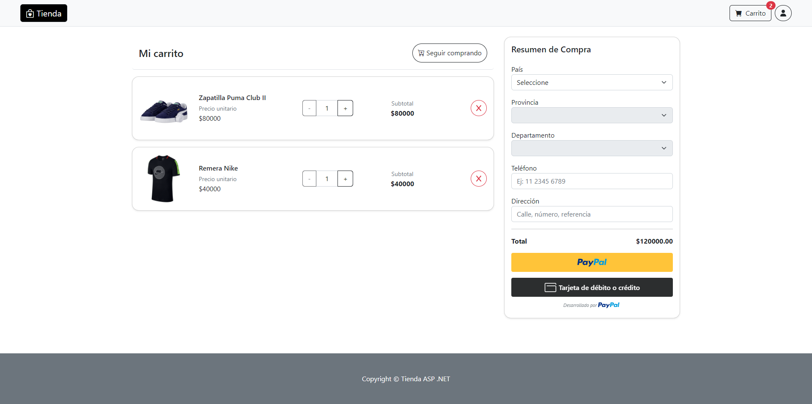
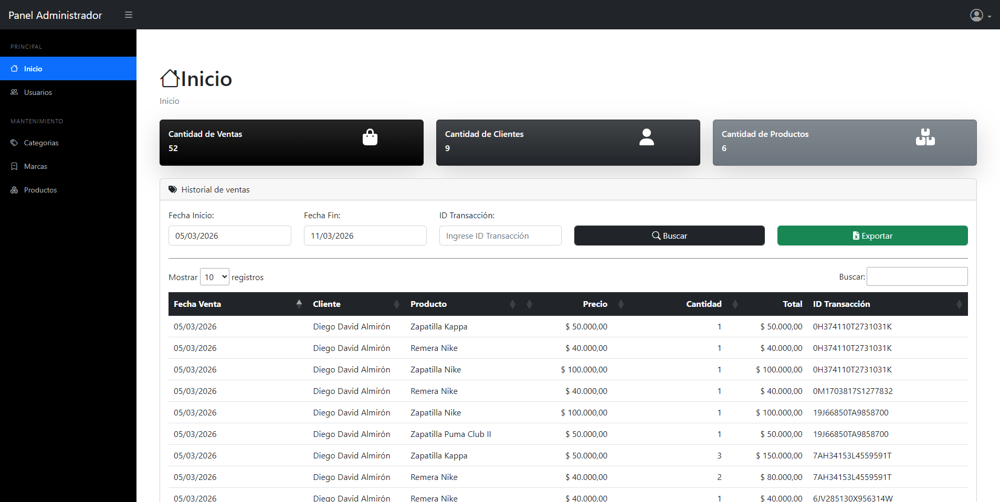
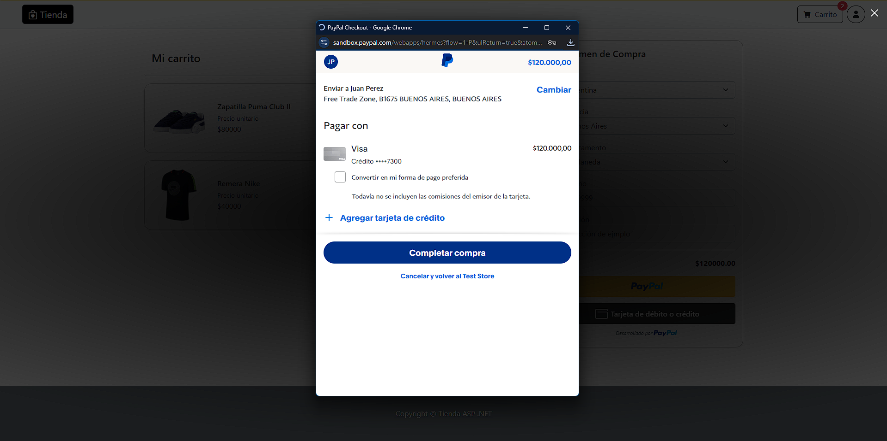

# 🛒 Tienda ASP.NET MVC

Proyecto desarrollado en **ASP.NET Core MVC** siguiendo una **arquitectura en capas**, orientado a la construcción de una aplicación web tipo tienda, con separación clara de responsabilidades y buenas prácticas de desarrollo.

---

## 📌 Descripción

Esta aplicación implementa un sistema de tienda web utilizando el patrón **MVC (Model–View–Controller)** y una estructura en capas que facilita el mantenimiento, la escalabilidad y la reutilización del código.

La interfaz se construye utilizando **Razor Views** y se incorporan interacciones dinámicas mediante **AJAX con jQuery**, permitiendo realizar operaciones sin recargar la página.

El sistema también integra **pagos online mediante PayPal**, utilizando los servicios de **PayPal Developer**, lo que permite procesar compras dentro de la aplicación.

El proyecto forma parte de un proceso de aprendizaje y práctica en desarrollo web con **.NET**, enfocado en aplicaciones reales.

---

## 🚀 Funcionalidades principales

- Catálogo de productos
- Carrito de compras
- Gestión de productos desde panel administrativo
- Integración con **PayPal** para realizar pagos
- Interacciones dinámicas mediante **AJAX y jQuery**
- Separación en capas para una arquitectura más mantenible

---

## 🏗️ Arquitectura del proyecto

El proyecto está organizado en las siguientes capas:

### **CapaEntidad**
- Contiene las entidades del dominio (modelos de negocio)
- Define la estructura de los datos

### **CapaDatos**
- Acceso a datos
- Comunicación con la base de datos
- Implementa repositorios y consultas

### **CapaNegocio**
- Lógica de negocio
- Validaciones y reglas del sistema

### **CapaPresentacionAdmin**
- Interfaz web para la administración
- Controladores y vistas del panel administrativo

### **CapaPresentacionTienda**
- Interfaz web orientada al usuario final
- Controladores y vistas públicas de la tienda

---

## 💳 Flujo de pago con PayPal

El sistema integra **PayPal Checkout** utilizando los servicios de **PayPal Developer**.

Flujo del proceso de pago:

1. El usuario agrega productos al carrito.
2. Confirma la compra desde la tienda.
3. Se genera una orden de pago.
4. PayPal procesa la transacción.
5. La aplicación confirma el pago y registra la compra.

Esta integración permite simular pagos en **modo sandbox** durante el desarrollo.

---

## 🧩 Diagrama de arquitectura

La aplicación sigue una **arquitectura en capas**, donde cada capa tiene responsabilidades específicas.

---


Esto permite:

- Mayor **mantenibilidad**
- Mejor **organización del código**
- **Separación de responsabilidades**

---

## 📸 Capturas del proyecto

### 🏪 Página principal de la tienda



---

### 🛒 Carrito de compras



---

### ⚙️ Panel de administración



---

### 💳 Proceso de pago con PayPal



---

## 🧰 Tecnologías utilizadas

- **ASP.NET Core MVC**
- **C#**
- **Razor Views**
- **HTML / CSS**
- **JavaScript**
- **jQuery**
- **AJAX**
- **Bootstrap**
- **SQL Server**
- **PayPal Developer API**
- **Visual Studio**
- **Git & GitHub**

---

## ⚙️ Requisitos previos

- Visual Studio 2022 o superior  
- .NET SDK compatible  
- SQL Server (local o remoto)  
- Cuenta de **PayPal Developer** para pruebas de pago  
- Git  

---

## ▶️ Cómo ejecutar el proyecto

1. Clonar el repositorio

```bash
git clone https://github.com/diego939/tienda_asp.net.git
